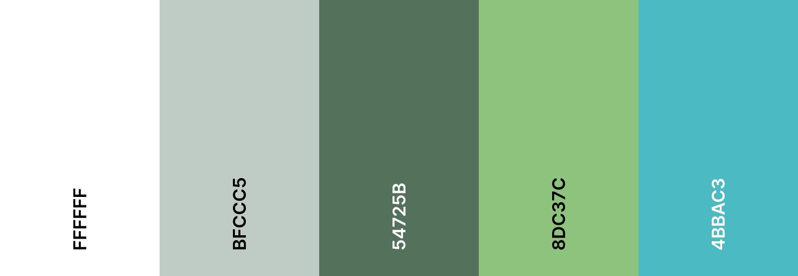
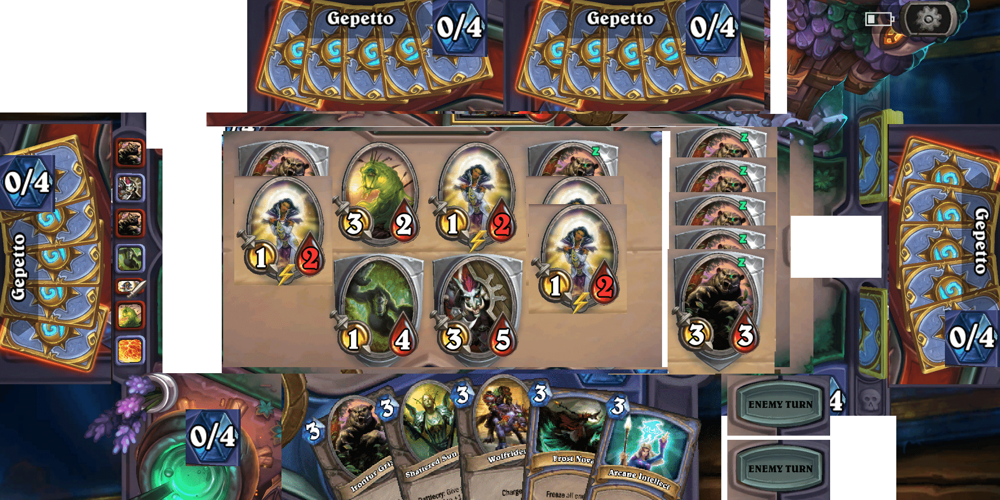
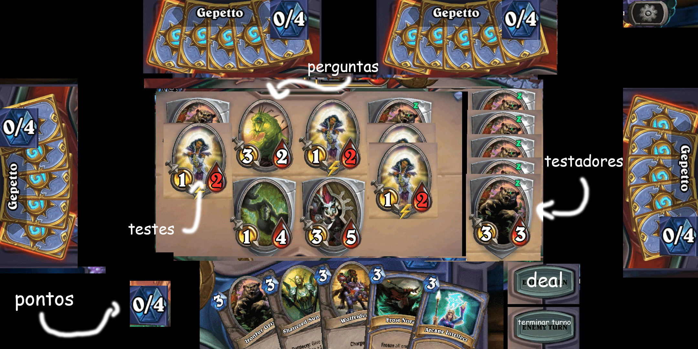

# Jogo
## Conceito
jogo de cartas multiplayer para o aprendizado interativo sobre teste de software
## Baralho atual

|   TIPO   |         NOME          | ID  | QUANT |
| :------: | :-------------------: | :-: | :---: |
| vermelha |       perguntas       | Q*  |  37   |
|   azul   |     especialista      | A1  |   4   |
|   azul   | trabalho corporativo  | A2  |   4   |
|   azul   |       sabotagem       | A3  |   4   |
|   azul   |      estagiario       | A4  |   4   |
|   azul   |  contratação forçada  | A5  |   4   |
|   azul   |        espião         | A6  |   4   |
|   azul   | proposta intenacional | A7  |   4   |
|   azul   |      hora extra       | A8  |   4   |
|  verde   |      t,estresse       | V1  |   8   |
|  verde   |     t,usabilidade     | V2  |   8   |
|  verde   |      t,segurança      | V3  |   8   |
|  verde   |     t,desempenho      | V4  |   8   |
|  verde   |   t,funcionalidade    | V5  |   8   |
|  verde   |      t,aceitação      | V6  |   8   |
|  verde   |     c,temporario      | V7  |   8   |
|  verde   |       testador        | V8  |   8   |
|  verde   |      ferramenta       | V9  |   8   |
|  verde   |        reunião        | V10 |   4   |

|   tipo    | total |
| :-------: | :---: |
| vermelhas |  37   |
|   azuis   |  32   |
|  verdes   |  76   |
| **total** |  145  |

## Estrutura de turno
### Começo do jogo
- puxar X cartas
### Turnos restantes
- puxar uma carta
- usar cartas de efeito
- usar carta de testador
- jogar testes
	- acerto
		- puxar carta azul
		- rolar dado
			- acerto
				- pontuar Y
			- erro
				- encerra turno
	- erro
		- encerra turno
## Condição de vitória
- conseguir 5 pontos primeiro
# Indev
## Padronização
### Texturas
#### Main Menu

### Arquivos
- imagem
	- .png,.svg
	- snake_case
- áudio
	- .mp3
	- snake_case
- script
	- .gd
	- PascalCase
 - cena
	 - .tscn
	 - snake_case

#### ícones

| id  |         imagem          |                     |
| :-: | :---------------------: | ------------------- |
| 100 |   Teste de aceitação    | ![[100.png\|100]]   |
| 101 |   Teste de desempenho   | ![[101.png\|100]]   |
| 102 |    Teste de estresse    | ![[102.png\|100]]   |
| 103 | Teste de funcionalidade | ![[103.png\|100]]   |
| 104 |   Teste de segurança    | ![[104.png\|100]]   |
| 105 |  Teste de usabilidade   | ![[105.png\|100]]   |
| 200 |   contratação forçada   | ![[200.png\|100]]   |
| 201 |   Contrato temporário   | ![[201.png\|100]]   |
| 202 |         espião          | ![[202.png\|100]]   |
| 203 |       ferramenta        | ![[203.png\|100]]   |
| 204 | proposta internacional  | ![[204.png\|100]]   |
| 205 |        sabotagem        | ![[205.png\|100]]   |
| 206 |        testador         | ![[206.png\|100]]   |
| 207 |  trabalho corporativo   | ![[207.png\|\|100]] |
| 208 |      especialista       | ![[208.png\|100]]   |
| 209 |       estagiário        | ![[209.png\|100]]   |
| 210 |       hora extra        | ![[210.png\|100]]   |
| 211 |         reunião         | ![[211.png\|100]]   |
Créditos : <a href="https://www.flaticon.com/authors/dinosoftlabs" title="pagina do dinosoftlabs">ícones criados por DinosoftLabs - Flaticon</a>
### Padrão de código
- variaveis
	- snake_case
	- tipar variavel
	- deixar inicialização nula
- Sinais
	- PascalCase
- funções
	- PascalCase
	- sempre colocar retorno
	- tipar o parametro
- ordem
	- extends
	- class_name
	- signals
	- @export
	- @onready
	- var
	- enum
	- funcs
- comentado caso necessário 

>[!NOTE]- Exemplo
>```gdscript
>extends parent
>class_name class
>
>signal SendMessage(message)
>
>@export var name:string
>
>@onready var name_label:label = $label
>
>var count:int
>
>enum state {DOING,NOT_DOING}
>
>func DoSomething(param:int) -> void:
>	pass
>```

## Desenvolvimento
### UI jogo



# arquitetura 

todos objeto devem ter um objetivo em especifico e sempre utilizalo para aquele motivo especifico no momento em que ele se repetir em objetos diferente crie um novo objeto e faça esse comportamento modular e faça dele um componente de outro
## cartas

data -> model -> view

cada carta aponta para um único card_data dentro dos deck, uma card_data instancia varias cartas porem toda carta tem somente um card_data, o card_data possui as propriedades basicas de cada carta
```gdscript
@export var card_name: String = "Nova Carta"
@export var artwork : Texture2D
@export var description : String = ""
@export var effects : Array[Effect]
```
e possui uma lista de efeitos modulares que funcionam como componentes que são generalistas

## Recursos
data_card -> dados da carta
card_deck -> conjunto de cartas que forma o deck
effect -> efeito modular na carta que faz a generalização da ação de toda carta
## Nós
card -> model para a vizualização e interação da carta
dealer -> pega dados do deck e transforma o data_card em um card para interação
player -> guarda os dados dos jogadores
dropzone -> server para fazer a interação da carta com outras entidades